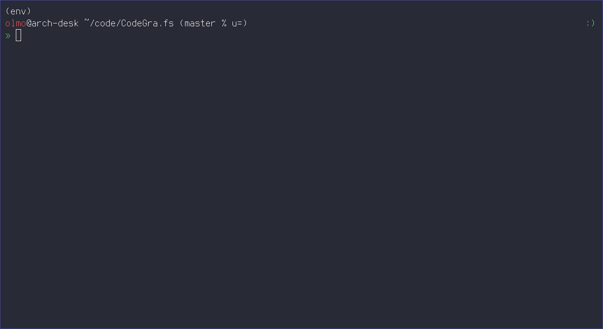

# CodeGra.vim

*The* Vim plugin for CodeGra.de



## Dependencies

CodeGra.fs must be installed and both `cgfs` and the helper program
`cgapi-consumer` must be available from the user's `$PATH`.

## Usage

Mount your CodeGra.de account to a directory and open a file in one
of the filesystem's subdirectories:

```sh
$ cgfs ~/CodeGra.de
Mounting...
Mounted
$ vim ~/CodeGra.de/<course>/<assignment>/<submission>
```

The following commands are available in Vim:

| Command | `--fixed`<a href="#footnote-1-b"><sup id="footnote-1-a">1</sup></a> | Description |
|---|---|---|
| CGShowLineFeedback | ✗ | Show the line-feedback for the current buffer in the quickfix list and open the quickfix window. |
| CGEditLineFeedback | ✓ | Edit the comment for the current line in the current buffer. |
| CGReloadLineFeedback | ✗ | Reload the line-feedback for the current buffer. |

<a href="#footnote-1-a"><sup id="footnote-1-b">1</sup></a>: Require the filesystem to be mounted with the `--fixed` flag to use this feature.

## License

CodeGra.vim is released under [LICENSE](AGPL-v3.0).
